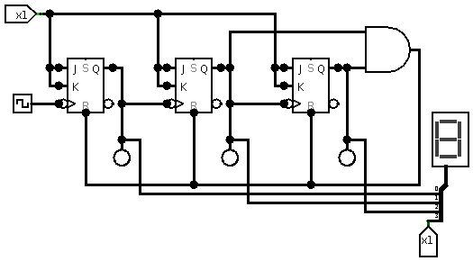

# computer systems week 3 lecture notes

## assignment 1

- start it asap
- worth 15%
- due week 7, start of the week
- designing the interface for a music player
- must use logisim for this assignment
- ask questions on the discussion board
- upload assignment as zip file to canvas
- no built in shift registers
- free to use the built in flip flops

## registers

- fast ram (uses transistor states)
- uses clocked flip flops
- inside the cpu chip
- limited number of them (cause it's hardware)
- a register (many bits) or latch (usually one bit) can be made up from a series of d flip flops
- all the flip flops are synced up by the clock that they are all connected to

a 4 bit register made of d flip flops

## counters

- ripple counters work with jk flip flops
- each flip flop must be set on the falling edge to count forwards
- counter will go backwards if flip flops are set on the rising edge
- ripple counter works by using each flip flop like a T flip flop and then setting the next clock input to be the Q of the current flip flop
- ripple counters don't work well if you want to count up to an arbitrary number
- it's also not a safe counter due to there being no real timing

ripple counter using jk flip flops (big endian)

ripple counter that is limited to 0-5 (little endian)

- common clock counters are safe because it is bound by the common clock

common clock 2 bit counter

- if you want to make a 3 bit counter and above however it's more complicated than just chaining this together

common clock 3 bit counter

- we can use a register made of d flip flops to make the output more stable and safe
- doing this will, however, will give the output a one tick delay

common clock 3 bit counter with a d flip flop register (place image here)

## shift registers

- takes one input from one end and with each tick this input is shifted to the next d flip flop
- allows us to do serial to parallel conversion
  - serial into the first d flip flop
  - read out all of the inputs at the same time (parallel)
- uses a common clock to synchronise
- can be used to multiply a bit
  - each time the bit moves along (little endian way) it is multiplied by two
- can be used to divide a bit
  - same as multiplication, but in the opposite direction to divide by two

## bi-directional shift register

- has a bit that will indicate whether the shifting goes left or right
- two inputs for either the left or right

bi-directional shift register
