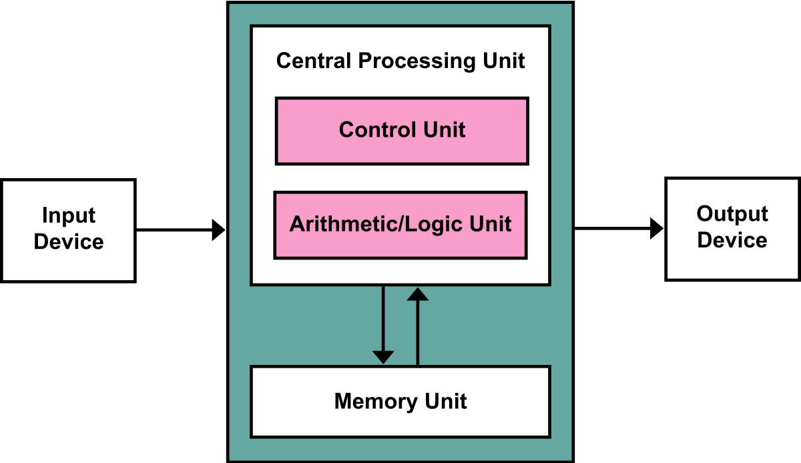

# computer systems week 4 lecture notes

## types of memory

- ROM (read only memory)
  - contents built in at the time of manufacture
  - can be flashed (all information on it at once)
- PROM (programmable read only memory)
  - programmed by a once only irreversible operation
- EPROM (erasable programmable read only memory)
  - can be removed from the computer
  - sometimes called field programmable
  - bulk erased: every byte erased at the same time
- EEPROM (electrical erasable programmable read only memory)
  - **put some info here**
- RAM (random access memory)
  - these days is more like RWM (read-write memory)
- static RAM
  - retains information until power removed
  - fast, larger area of silicon per byte
  - modest power requirement
- dynamic RAM
  - implemented with capacitors
  - retains informatoin as long as the contents are refreshed frequently enough
  - smaller area of silicon per byte
  - low power requirement
  - does not use flip flops
  - **put more info here**
  - not as fast as static RAM
- SDRAM (synchronous DRAM)
  - hybrid of dynamic and static tech
  - "clocked" by the main cpu clock
- DDR (double data rate) SDRAM
  - chips product data on rising and falling edges of the clock
  - higher data rate (eg. 64 bits/nsec)
- FRAM (Ferroelectric RAM)
  - uses atom position in unit cell (in theory)
  - actual density about the same as DRAM
  - non volatile (no need for power to keep state)
  - cannot read state explicitly -- required to change states and measure changes to see state
  - used in specialist devices (where you never want to "turn it off and on again)
- flash memory (EEPROM)
  - has a finite life
  - read/writes over time will degrade it
  - charge stored between insulators
  - write bits by injecting electrons thorugh a barrier layer (physically damaging it)
  - used in usb drives
  - good for about 30,000 writes
  - can use wear levelling logic to prolong the life of the memory
- core memory
  - magnetic "core" memory
  - each bit stores as a magnetic bit

## memory addressing

- memory is indexable
- ram consists of one or many chips
- ram is organised into **words** (eg. of 32 bits)
- words are organised into **pages**
- words are selected by an **address**
- control bits specify whether to read or write to the memory
- a byte is *typically* the smallest addressable chunk of memory
- with more memory comes more issues with addressing

## stacks

- first in, first out structure just like in any other lang
- allows us to essentially remember what we're doing in sequence
- only requires one address for the top of the stack
- if you put more than the stack can hold on the stack then you get a stack overflow

## stacks and von neumann

- control bits and data bits share a common memory space/hardware
- allows processes to be interrupted (and stored as data) while higher priority tasks are executed, and then restored and resumed (interrupts)
- requires the use of a stack that is implemented either through hardware or software

## harvard architecture

- a computer architecture where instructions and data are kept separate
- runs faster (generally) and more secure (generally) than von neumann, but more expensive and less extensible
- data bus and control buses can be different widths, types
- **more info to go here**

## modified harvard

- used in arm, most intel cpus
- von neumann with separate instruction and data caches in the cpu
- has the speed of harvard but flexibility of von neumann
- same vulnerabilities as von neumann
- still uses stacks so it supports interrupts

## cpu caches

- stores frequently accessed instructions/data in high-speed memory
- what is in the cache depends on the caching algorithm
- can have separate instruction and data caches
  - instrutions are smaller and more predictable in format so have dedicated hardware (read access) to data caches (RW access)
  - increases processing speed -- instructions and data can be loaded at the same time
- can have separate layers (L1, L2, L3) depending on the speed/frequency requirement

## interrupts

- stacks allow interrupt-based hardware access
- a device (eg. I/O) issues and electrical signal, which feeds into a priority encoder which then issues an INT signal to the cpu (depending on relative priority)
- current work of the cpu is pushed onto the stack
- cpu loads the interrupts handler routine
- the INT handler ends with a RETurn instruction

## how I/O INTs work

- **more info to go here**

- any routine can be interrupted, including the code loaded by an INT handler routine if the priority is higher
- loading an INT handler is **atomic** (cannot be interrupted)

## types of INTs

- clock -- countdown timer
- keyboard/mouse
- error
- network -- packet being recieved by the NIC
- exceptions
- syscall - INT 80 (in asm) triggers a kernel or system command to be executed
- hardware -- eg. power button generates an ATX event

## polling

- alternative to interrupts
- check state/input of each hardware device in a pre-defined sequence
  - process and change/input as needed
- issues:
  - can waste time checking hardware which is doing nothing
  - doesn't take advantage of the stack
  - if one device freezes it can make the entire system unresponsive
- is simple to implement

## recursion

- a function that calls itself
- von neymann architecture also supports recursion
- each new instance of a recursive procedure is launched in its own stack frame
- after pushing IP pointing to the previous process onto the stack
- **more info here**

## building a hardware stack

**place image of hardware stack here**

- starts with a bi-directional shift register
- data is serial input
- generally don't provide a parallel output
- add more depth with more flip flops
- add width by copying the stack side by side (in parallel)
