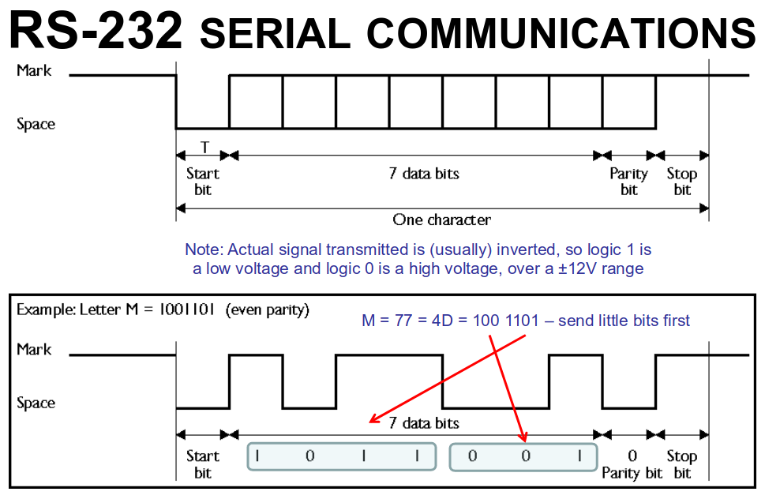
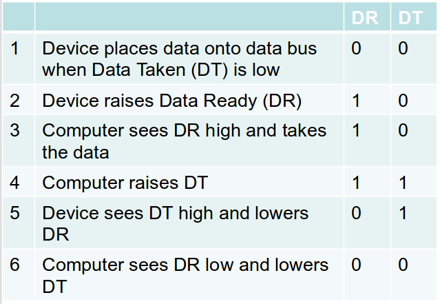

# computer systems week 5 lecture notes

## what is data?

- information or knowledge
- can be measured, visualised, analysed, etc

## what is communication?

- how we convey data

## data communication

- simplex
  - data travels in one direction
- half duplex
  - data travels in both directions, but not at the same time
- full duplex
  - data travels in both directions simultaneously
- a computer collects info from the world around it (analouge)
- must convert info from analouge to digital
- computers send info to other computers, sometimes in analouge form
- computers can communicate through serial and parallel as well as simplex/half duplex/full duplex
- when communicating serially it is asynchronous
  - both devices need to decide on a transmission (or baud) rate so they know how fast they need to send/recieve
  - these days baud rate can be determined automatically between some devices
- when sending an 8-bit data byte:
  - the TxD line is pulled low for one period T of the start bit
  - 7 bits of data are sent
  - one or two stop bits follow the data to ensure a gap before the next byte is sent
- sending data is always subject to interference or noise that can cause bits to be misread
- we use a parity bit to be able to verify that the data is good
- the parity bit will be 1 or 0 to ensure that the amount of 1s in the byte are even
  - eg. 3 1s in the byte will make the parity bit 1, 4 1s in the byte will make the parity bit 0
- we can reasonably assume that if it is not correct then the data is incorrect and we can request it again

- parallel allows us to transmit multiple bits at a time
- parallel requires larger connectors due to the higher amount of pins required to support the bits being sent
- parallel is not as flexible as serial since it tends to need to be reworked for the application it is intended to be used for
- works with a handshake protocol to ensure both ends are ready to communicate

## tradeoffs

| parallel | serial |
| --- | --- |
| faster, whole data word transmitted at once | slower than parallel, transmitted one bit at a time |
| only good over short distances: expensive and bulky cables; cross interference | good over short distances and better than parallel over long distances. less cross interference |

## number representation

- computers can handle different kinds of data such as numbers, characters, etc
- number systems:
  - dec
  - bin
  - hex
  - oct
