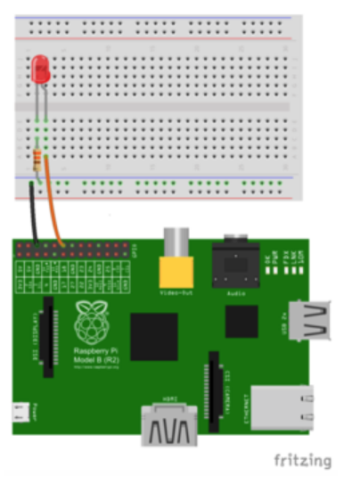

# computer systems week 7 lecture notes

## assignment 2

- will be on rpis
- will be demo'd in labs

## ARM assembly

- look at:
  - baking pi -- operating systems development by alan chadwick
  - raspberry pi bar metal assembly programming by peter lemon
- lab 7-9 are all working with LEDs
- lab 10 is screen writing

## FASMARM

- syntax is simpler than traditional ARM ASM
  - no need for `.section`, `_start`, and `.global`
  - native support for named constants
  - no makefiles
- however...
  - some ASM commands are not supported
  - error messages aren't always helpful

## why do you need to know ASM?

- to write tiny/fast programs
- no os to get in the way
- you can write compilers
- you can write drivers for custom hardware
- ability to find vulnerabilities in code
- customised programs without source code
- bypass stack security features/copy protection
- knowing what happens under the hood can make you a better programmer
  - realise what's going on, what is more efficient
- reverse engineering binaries
- all binaries can be disassembled to ASM

## compliation process

- ASM (through FASM)
  - source code -> compile -> kernel.img
    - command is `fasmarm main.asm kernel.img`
  - copy kernel.img to rpi and turn on rpi
- we can also compile to an object file (.o)
  - can be used by other binaries
  - we can translate .o files into ASM
  - .o files are the intermediate files created before all files are linked together for the full binary

## ASM code

- `;` is for comments
- `.` is an instruction for the assembler
  - `.section .init` is for defining initial labels such as `_start`
  - `.section .data` is for hard coded "variables"
  - `_start` is a label for where the code commences
  - all of the above is handled by FASM

## FASM syntax

- source ccode has one section (but you can include other files):

```assembly
VARIABLELABEL = value   ; hard-coded variable
include 'otherfile.asm' ; including other source files

format binary as 'img'  ; specify ext of kernel (compiled) file

label:                  ; start of function, dest. of goto, start of array or struct

                        ; hex represented with a leading $
                        ; dec represented with a leading #
```

## we can...

- define functions
- define variables
- undefine variables (at runtime)
- include files
- work with arrays
- call os functions (if in an os)
- call c functions (if you link to a c lib)
- use `goto`

## rpi boot process

1. GPU
2. bootloader reads SD card, reads `bootcode.bin` and loads it into L2 cache
3. second bootloader (`bootcode.bin`) enables RAM, reads GPU firmware (`start.elf`)
4. `start.elf` reads `config.txt` for special settings, loads and runs kernel

```
if (rpi2 && kernel7.img is found)
  runs kernel7.img
else
  runs kernel8.img
```

## turning a light on



- LED wired into GND and GPIO18
- ARM7 CPU gives us 13 general purpose 32-bit registers to work with
  - ARM8 has 31 64-bit registers
  - r0, r1 .. rn
- we use these registers to load in values, perform operations, and write back out to memory
- we also use them to pass arguments to functions

### GPIO

- GPIO chip has 54 registers which can be read, set high or low
- they are referred to as GPIO0, GPIO1, ...
- some are connected to physical connectors on the rpi board
- others are connected to hardware on the board

### setting hardware pin on

1. establish which GPIO is associated with the pin
2. find the associated "function" register and set the appropriate bits to indicate your intention to write to that GPIO
3. find the appropriate "write" register and set the output bit to 1

- essentially all breaks down to:
  - tell the hardware what you want to do
  - tell the hardware to do it

### ldr

```assembly
ldr r0, [r1] ; syntax: register to write to, [pointer to value in memory]
             ; laods register 0 with the value pointed to by r1
```

### mov

```assembly
mov r1, #1 ; syntax: register to write to, value
           ; loads r1 with dec 1

mov r1, $1 ; loads r1 with hex 1
```

### orr

```assembly
orr r1, $21 ; syntax: register (input and destination), operand (may be a register, pointer, literal)
            ; r1 = r1 OR operand
```

### lsl

```assembly
lsl r1, #21 ; syntax: register, literal value (no pointers)
            ; logical shift left (shifts all bits left, or in others words doubles the value)
            ; can think of this like powers, so r1 to the power of 21
```

### str

```assembly
str r1, [r0, #16] ; syntax: register, [reference to register, offset value in dec]
                  ; store register
```

### branch

```assembly
loop:  ; label
b loop ; goto label
       ; infinite loop, stops program from crashing
```

## back to turning on the LED

- we need to access the correct GPIO registers and set specific bits
- first we need to know where in memory the location of these registers are
- specifically we need to know:
  - the BASE address for all memory we need to access
  - the GPIO offset, or number of bytes from the BASE address from which the GPIO registers start

```
loop:
    store location of GPIO (BASE + GPIOADDR) in r0
    enable writing for GPIO18
    set output of GPIO18
```

- `0x3F200000` is the offset we begin at for writing to GPIO
- each register is offset by 4
  - next register for GPIO10-19 would be at `0x3F200004`

```assembly
BASE = $20000000
GPIO_OFFSET = $200000

mov r0, BASE
orr r0, GPIO_OFFSET ; sets r0 to 0x20200000
mov r1, #1
lsl r1, #18         ; writes 1 into r1, lsl 18 times to move the bit to 1 bit 18
str r1, [r0, #4]    ; write it into the 2nd (4/4+1) block of function register

mov r1, #1
lsl r1, #16         ; write 1 into r1, lsl 16 times to move 1 to bit 16
str r1, [r0, #40]   ; write it into the first block of pull-down register

loop$:
b loop$             ; loop forever

```
